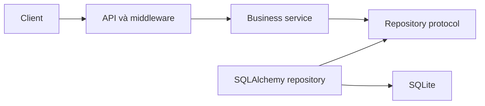

# Movie Ticket Booking API

Backend REST API cho nghiệp vụ đặt vé xem phim ở Pha 1. Repo này là baseline để
ba thành viên phát triển độc lập ba feature `auth`, `catalog` và `booking` mà
không phải cùng sửa một file chung.

> Trạng thái baseline: ứng dụng, Swagger, middleware JWT, ORM models, Docker,
> test kiến trúc và khung kiểm thử tải đã có. Chín endpoint nghiệp vụ đã xuất hiện
> trong OpenAPI nhưng chủ động trả `501` cho tới khi feature tương ứng được triển khai.

## Phạm vi Pha 1

| Method | Endpoint | JWT | Chủ sở hữu |
| --- | --- | --- | --- |
| POST | `/auth/register` | Không | Chiến |
| POST | `/auth/login` | Không | Chiến |
| GET | `/movies` | Không | Hải |
| GET | `/showtimes` | Không | Hải |
| GET | `/showtimes/{showtime_id}/seats` | Không | Hải |
| POST | `/bookings` | Có | Đạt |
| GET | `/bookings/me` | Có | Đạt |
| GET | `/bookings/{booking_id}` | Có | Đạt |
| DELETE | `/bookings/{booking_id}` | Có | Đạt |

`GET /health` là endpoint kỹ thuật, không tính vào chín endpoint nghiệp vụ.

Không làm payment, frontend, email ticket, giữ ghế tạm thời hay trang admin ở
Pha 1. Dữ liệu phim, phòng, ghế và suất chiếu được tạo bằng script seed.

## Kiến trúc



- `api.py` và `schemas.py`: HTTP, JSON, Pydantic và status code.
- `dependencies.py`: nối Session -> Repository -> Service riêng từng feature.
- `service.py`: business rules thuần Python; cấm import FastAPI và SQLAlchemy.
- `contracts.py`: Protocol để Service không phụ thuộc ORM.
- `repository.py`: SQLAlchemy và transaction.
- `app/domain`: entity và exception không phụ thuộc framework.
- `app/db`: ORM models, session và constraint dùng chung đã được khóa ở baseline.

Cây thư mục chính (tên thực trong repo):

```text
app/
  main.py
  api/             # router, error handlers, authentication middleware
  core/            # config, password/JWT helpers
  db/              # base.py, session.py, models.py, types.py
  domain/          # entities.py, errors.py
  features/
    auth/          # api, schemas, dependencies, service, contracts, repository
    catalog/       # api, schemas, dependencies, service, contracts, repository
    booking/       # api, schemas, dependencies, service, contracts, repository
tests/
  auth/            # Chiến triển khai
  catalog/         # Hải triển khai
  booking/         # Đạt triển khai
  foundation/      # kiểm tra JWT, hợp đồng API, constraints và UTC
  architecture/
  smoke/
  load/locustfile.py
scripts/           # seed, kiểm tra scope PR, Kaggle load runner
docs/              # API, naming, ownership, ports, load plan, audit
.github/           # CI và PR template
```

`tests/architecture/test_layer_boundaries.py` tự động chặn import sai tầng.

## Chạy local

Yêu cầu Python 3.11 trở lên.

```bash
python -m venv .venv
source .venv/bin/activate
pip install -r requirements-dev.txt
cp .env.example .env
python -m scripts.seed
uvicorn app.main:app --reload
```

Mở:

- Swagger UI: `http://127.0.0.1:8000/docs`
- OpenAPI JSON: `http://127.0.0.1:8000/openapi.json`
- Health check: `http://127.0.0.1:8000/health`

## Chạy test

```bash
ruff check .
ruff format --check .
pytest
```

Feature chưa triển khai sẽ còn lỗi `501`; từng nhánh phải thay stub bằng code và
thêm test của feature trước khi merge.

## Chạy bằng Docker

```bash
docker compose up --build
```

Swagger mở tại `http://127.0.0.1:8000/docs`. SQLite được lưu trong Docker volume
`movie_data`.

Tạo dữ liệu demo trong đúng database của container:

```bash
docker compose exec api python -m scripts.seed
```

`.env` được đọc khi chạy local. Biến môi trường đã export hoặc truyền từ Compose
ưu tiên hơn `.env`. File này được loại khỏi Git và Docker build context.

## Quy trình ba người

1. Tạo GitHub public repo từ baseline này và bảo vệ nhánh `main`.
2. Tạo ba nhánh từ cùng commit baseline: `feature/auth`, `feature/catalog`,
   `feature/booking`.
3. Mỗi người chỉ sửa thư mục feature và test mình sở hữu.
4. Contract hoặc ORM model dùng chung chỉ đổi trong PR riêng, có ba người xác nhận.
5. Merge theo thứ tự `auth` -> `catalog` -> `booking`; chạy full test sau mỗi PR.

Chi tiết ownership, tên biến, API contract và checklist nằm trong thư mục `docs/`.

## Commit đề xuất

```text
feat(auth): add user registration
feat(catalog): add showtime seat availability
feat(booking): prevent duplicate confirmed bookings
test(booking): add concurrent seat booking test
docs(api): clarify authenticated endpoints
fix(auth): normalize email before lookup
```

## Kiểm thử tải trên Kaggle CPU

Cài dependency tải và chạy script headless:

```bash
pip install -r requirements-load.txt
bash scripts/run_kaggle_load_test.sh
```

Kết quả theo từng mức tải được ghi vào `artifacts/locust-<users>u-report.html`,
CSV và metadata. Profile `full` có đăng ký/login, catalog và vòng đời booking
gồm xem chi tiết; chỉ chạy báo cáo cuối sau khi thay xong các stub.

Xem `docs/SKELETON_AUDIT.md` để phân biệt phần khung đã kiểm tra với phần nghiệp
vụ ba thành viên còn phải triển khai. Khung test pass không có nghĩa cả Pha 1
đã hoàn thành.
